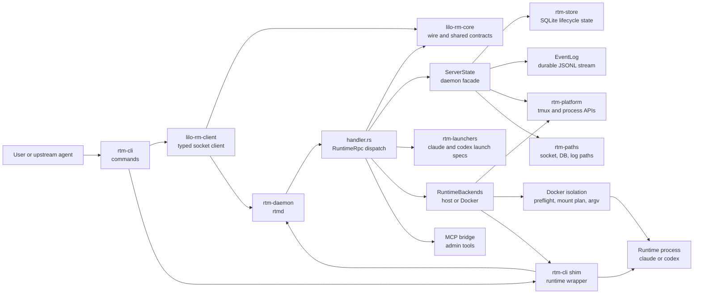
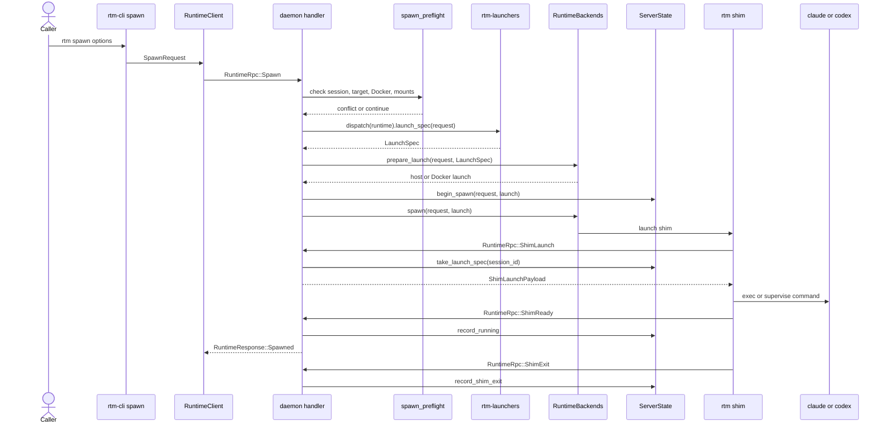
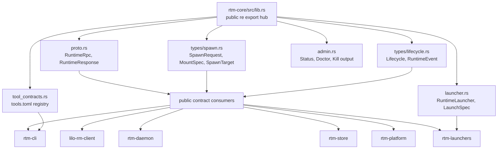

# runtime-matters Codebase Map

This map is for agents onboarding into `runtime-matters`.

Basis: current fmm MCP index, 143 indexed files, 20,624 LOC. Source split from fmm: 97 source files, 12,635 LOC; 46 test files, 7,989 LOC. Package names and crate dependency names were checked with Cargo metadata because fmm indexes source, not package manifests.

## Architecture Diagram



## Spawn Sequence Diagram



## Contract Dependency Diagram



## System Shape

```text
rtm CLI
  -> lilo-rm-client RuntimeClient
    -> lilo-rm-core RuntimeRpc JSON line protocol
      -> rtmd daemon handler
        -> spawn preflight
        -> rtm-launchers registry
        -> RuntimeBackends
          -> host backend
          -> Docker backend
        -> ServerState
          -> LifecycleStore SQLite state
          -> EventLog JSONL stream
          -> watcher, status, spawn, termination coordinators
        -> shim socket protocol
          -> rtm shim
            -> runtime process, currently claude or codex
```

The durable model is simple:

1. `lilo-rm-core` owns the public wire types and shared runtime contracts.
2. `rtm-cli` builds user requests and contains the shim binary path.
3. `lilo-rm-client` sends typed RPC over the daemon socket.
4. `rtm-daemon` owns lifecycle state, persistence, events, spawn orchestration, Docker wrapping, and reconciliation.
5. `rtm-store`, `rtm-platform`, `rtm-paths`, and `rtm-launchers` are narrow support crates.

## Crate Map

| Package | Path | Role | Start Here |
| --- | --- | --- | --- |
| `lilo-rm-core` | `crates/rtm-core` | Wire protocol, lifecycle types, spawn types, launcher traits, admin responses, MCP JSON RPC helpers, CLI output formatting, generated tool contract registry. | `src/proto.rs`, `src/types/spawn.rs`, `src/types/lifecycle.rs`, `src/launcher.rs`, `src/admin.rs`, `src/tool_contracts.rs` |
| `lilo-rm-client` | `crates/rtm-client` | Typed client around `RuntimeRpc` and `RuntimeResponse`, plus event watching. | `src/lib.rs`, `src/event_watcher.rs` |
| `rtm-daemon` | `crates/rtm-daemon` | Long running daemon. Owns socket accept loop, RPC handling, lifecycle transitions, event log, Docker isolation, reconciliation, doctor data. | `src/server/runner.rs`, `src/handler.rs`, `src/server/state.rs`, `src/backend.rs` |
| `rtm-cli` | `crates/rtm-cli` | User CLI, daemon subcommands, spawn/status/events commands, the shim command, generated help and MCP tool surfaces. | `src/main.rs`, `src/cli/mod.rs`, `src/cli/spawn.rs`, `src/cli/shim.rs`, `build.rs` |
| `rtm-store` | `crates/rtm-store` | SQLite lifecycle store and codec layer. | `src/sqlite/lifecycle.rs`, `src/sqlite/lifecycle/codec.rs`, `src/schema.rs` |
| `rtm-platform` | `crates/rtm-platform` | OS interactions: tmux, process liveness, process exit watching, signals. | `src/tmux.rs`, `src/process.rs`, `src/process_exit.rs` |
| `rtm-launchers` | `crates/rtm-launchers` | Static launcher registry for supported runtimes. Resolves `claude` and `codex` commands and runtime env. | `src/lib.rs`, `src/claude.rs`, `src/codex.rs` |
| `rtm-paths` | `crates/rtm-paths` | Runtime socket, DB, log, shim, and home path resolution. | `src/lib.rs` |

## Core Contracts

`lilo-rm-core` is the shared contract crate. Touch it first when a change affects CLI, daemon, client, tests, generated schemas, or downstream littleorgans callers.

Important symbols:

| Contract | File | Lines | Notes |
| --- | --- | ---: | --- |
| `RuntimeRpc` | `crates/rtm-core/src/proto.rs` | 83 to 125 | Every daemon request variant, including spawn, status, events, MCP bridge, and shim messages. |
| `RuntimeResponse` | `crates/rtm-core/src/proto.rs` | 240 to 260 | Every daemon response variant, including typed errors, cursor expiration, and spawn conflicts. |
| `SpawnRequest` | `crates/rtm-core/src/types/spawn.rs` | 207 to 224 | Session id, runtime, isolation policy, image, env, mounts, cwd, target, force, and shell resume. |
| `MountSpec` | `crates/rtm-core/src/types/spawn.rs` | 82 to 90 | Shared mount type. Parser lives in `impl FromStr for MountSpec`, lines 147 to 184. |
| `RuntimeLauncher` | `crates/rtm-core/src/launcher.rs` | 64 to 92 | Trait used by `rtm-launchers` to convert a `SpawnRequest` into a `LaunchSpec`. |
| `Lifecycle` and `RuntimeEvent` | `crates/rtm-core/src/types/lifecycle.rs` | 53 to 204 | State and event vocabulary used by store, daemon, CLI, and client. |
| `VersionInfo` and capabilities | `crates/rtm-core/src/version.rs` | 6 to 73 | Protocol version and advertised capability list. |
| `ToolContract` | `crates/rtm-core/src/tool_contracts.rs` | 16 to 27 | Input for generated CLI help, generated MCP tools, README surface, and skill docs. |

Changing these types usually means updating serde snapshot tests in `crates/rtm-core/tests/serde_snapshots.rs` and wire tests in `crates/rtm-core/tests/wire_compat.rs`.

## Spawn Flow

The main spawn path is visible in `crates/rtm-daemon/src/handler.rs:handle_rpc_result`, lines 101 to 194.

```text
rtm spawn
  -> rtm-cli/src/cli/spawn.rs builds SpawnRequest
  -> lilo-rm-client RuntimeClient.spawn sends RuntimeRpc::Spawn
  -> handler::handle_rpc_result
    -> spawn_preflight::check
    -> rtm_launchers::dispatch(...).launch_spec(...)
    -> RuntimeBackends::prepare_launch
    -> ServerState::begin_spawn
    -> RuntimeBackends::spawn
    -> shim sends ShimReady
    -> ServerState::record_running
    -> RuntimeResponse::Spawned
```

Key source points:

| Step | Source |
| --- | --- |
| CLI command enum | `crates/rtm-cli/src/cli/mod.rs`, `Command`, lines 32 to 62 |
| Client spawn call | `crates/rtm-client/src/lib.rs`, `RuntimeClient.spawn`, lines 48 to 56 |
| Daemon request match | `crates/rtm-daemon/src/handler.rs`, `handle_rpc_result`, lines 101 to 194 |
| Preflight conflict check | `crates/rtm-daemon/src/spawn_preflight.rs`, `check_with_docker_inspector`, lines 27 to 59 |
| Backend selection | `crates/rtm-daemon/src/backend.rs`, `RuntimeBackends.prepare_launch`, lines 33 to 42; `RuntimeBackends.spawn`, lines 44 to 53 |
| Spawn coordination | `crates/rtm-daemon/src/server/spawn.rs`, `SpawnCoordinator`, lines 15 to 220 |
| Daemon state facade | `crates/rtm-daemon/src/server/state.rs`, `ServerState`, lines 27 to 242 |

`ServerState` is intentionally a facade. It delegates to coordinator modules:

| Coordinator | File | Responsibility |
| --- | --- | --- |
| `SpawnCoordinator` | `crates/rtm-daemon/src/server/spawn.rs` | Pending launch specs, pending shim ready senders, target validation, recording running state. |
| `TerminationCoordinator` | `crates/rtm-daemon/src/server/termination.rs` | `ShimExit`, watcher exits, terminal lifecycle transitions, kill by PID. |
| `WatcherCoordinator` | `crates/rtm-daemon/src/server/watcher.rs` | Runtime process exit watcher registration and watcher counts. |
| `StatusReader` | `crates/rtm-daemon/src/server/status.rs` | Status queries and log availability hydration. |
| `EventAppender` | `crates/rtm-daemon/src/server/events.rs` | Event append and events cursor reads over `EventLog`. |

## Shim Flow

The shim exists so runtime exit evidence is captured even if the runtime dies between daemon polls.

```text
daemon backend launches rtm shim
  -> shim requests LaunchSpec with RuntimeRpc::ShimLaunch
  -> daemon returns the pending launch
  -> shim execs or supervises runtime command
  -> shim sends RuntimeRpc::ShimReady
  -> shim sends RuntimeRpc::ShimExit
```

Start points:

| Area | File | Notes |
| --- | --- | --- |
| Shim command | `crates/rtm-cli/src/cli/shim.rs` | `run`, `run_for_session_blocking`, signal handling, launch env application, runtime wait. |
| Daemon shim launch helpers | `crates/rtm-daemon/src/shim_socket.rs` | `launch_shim`, `request_launch`, `send_ready`, `send_exit`, log path handling. |
| Daemon RPC handling | `crates/rtm-daemon/src/handler.rs` | `ShimLaunch`, `ShimReady`, and `ShimExit` branches in `handle_rpc_result`. |
| Lifecycle recording | `crates/rtm-daemon/src/server/spawn.rs` and `server/termination.rs` | Running and terminal state transitions. |

## Docker Isolation

Docker support is split across validation, argv construction, and runtime operations.

```text
SpawnRequest.isolation = Docker(profile)
  -> spawn_preflight checks image, user, architecture, mounts, path shaped env coverage
  -> docker_mount_plan validates cwd and explicit mount relationships
  -> docker_runtime delegates argv construction to docker_argv
  -> backend wraps the LaunchSpec or starts Docker directly
```

Key files:

| File | Role |
| --- | --- |
| `crates/rtm-core/src/isolation.rs` | `IsolationPolicy` and `IsolationProfile` parse and serialize the host versus Docker boundary. |
| `crates/rtm-daemon/src/spawn_preflight.rs` | Spawn validation. It checks duplicate session ids, tmux occupancy, Docker image metadata, mount shape, and path shaped env coverage. |
| `crates/rtm-daemon/src/docker_preflight.rs` | Docker CLI image inspection, root user checks, architecture checks, and env defaults. |
| `crates/rtm-daemon/src/docker_mount_plan.rs` | Pure path planning. It decides cwd auto mount, cwd remap, duplicate targets, and explicit mount overlap rules. |
| `crates/rtm-daemon/src/docker_argv.rs` | Pure Docker argv construction. `docker_run_launch`, lines 16 to 45, turns a `LaunchSpec` into `docker run` argv. |
| `crates/rtm-daemon/src/docker_runtime.rs` | Effectful Docker runtime wrapper. It supplies the Docker command and exposes Docker liveness, kill, and launch helpers. |

Tests to start with:

| Test File | Coverage |
| --- | --- |
| `crates/rtm-daemon/src/spawn_preflight/tests/mounts.rs` | Mount coverage, duplicate targets, cwd remap, path shaped envs. |
| `crates/rtm-daemon/src/spawn_preflight/tests/image_availability.rs` | Docker image availability and architecture checks. |
| `crates/rtm-daemon/src/spawn_preflight/tests/image_user.rs` | Root user policy. |
| `crates/rtm-cli/tests/docker_e2e.rs` | Opt in real Docker lifecycle and workdir remap integration. |
| `crates/rtm-cli/tests/spawn_target.rs` | CLI `--mount`, `--image`, `--env`, target, and conflict behavior. |

## Persistence And Events

There are two durable records:

1. SQLite lifecycle state in `rtm-store`.
2. JSONL event stream in `rtm-daemon`.

`LifecycleStore` lives in `crates/rtm-store/src/sqlite/lifecycle.rs`, lines 23 to 351. It owns:

| Method Group | Purpose |
| --- | --- |
| `open`, `path_open`, `reset` | Store lifecycle. |
| `insert_forking`, `update_lifecycle`, `delete` | State mutation. |
| `get`, `list`, `running`, `running_tmux_occupant` | Reads and conflict checks. |
| `lifecycle_counts`, `recent_lost_since`, `last_probe_sweep`, `migration_state` | Doctor and status data. |

`EventLog` lives in `crates/rtm-daemon/src/event_log.rs`, lines 31 to 449. It owns append, cursor reads, long poll waiters, replay, recovery from partial tails, sync, and retention compaction. `EventAppender` in `server/events.rs` is the facade exposed through `ServerState`.

## Reconciliation And Liveness

`rtm-daemon/src/reconcile.rs` owns startup and periodic reconciliation:

| Symbol | Role |
| --- | --- |
| `reconcile_startup` | Converts existing running rows into current truth at daemon boot. |
| `run_periodic` | Background sweep loop started by `run_daemon`. |
| `ProcessProbe` and `SystemProcessProbe` | Host process liveness seam. |
| `DockerLiveness` and `DockerCliLiveness` | Docker container liveness seam. |
| `host_lost_evidence` | Distinguishes alive, exited, pid reused, and missing process evidence. |

`run_daemon`, `crates/rtm-daemon/src/server/runner.rs` lines 12 to 61, warms the launcher registry, opens the store, prepares the socket, constructs `ServerState`, runs startup reconciliation, spawns periodic reconciliation, and accepts daemon connections.

## CLI Surface

`rtm-cli` has two different roles:

1. User facing CLI that sends RPC through `lilo-rm-client`.
2. Runtime shim command launched by the daemon.

Command modules under `crates/rtm-cli/src/cli`:

| Module | Purpose |
| --- | --- |
| `spawn.rs` | Builds `SpawnRequest`, parses `--env`, `--cwd`, `--target`, `--isolation`, `--mount`, and rejects host isolation mounts at CLI validation time. |
| `status.rs` | Sends status filters. |
| `events.rs` | Cursor and long poll output, including cursor expiration exit code. |
| `kill.rs` | Session kill and PID kill. |
| `nudge.rs` | Tmux nudge and typed failure output. |
| `capture.rs` | Tmux pane capture. |
| `doctor.rs` | Doctor output. |
| `daemon.rs` | Start, stop, and daemon status commands. |
| `mcp.rs` | MCP bridge command. |
| `shim.rs` | The runtime wrapper command. |
| `output.rs` | Human and JSON output formatting, stable error surfaces, JSON snapshot redaction. |

Generated surfaces:

| Source | Generated |
| --- | --- |
| `crates/rtm-core/tools.toml`, included by `tool_contracts.rs` | Tool contract registry. |
| `crates/rtm-cli/build.rs`, `write_generated_sources`, lines 79 to 89 | `src/generated/cli_help.rs`, `contracts.rs`, `mcp_tools.rs`, and generated module file. |
| `crates/rtm-cli/build.rs`, `write_readme` and `write_skill_doc` | README section and skill doc surface. |

When changing generated surface behavior, edit the authored contract first, then regenerate and update snapshots together.

## Platform Support

`rtm-platform` isolates OS process and tmux calls from daemon logic.

| File | Role |
| --- | --- |
| `src/tmux.rs` | `TmuxGateway` with `version`, `nudge`, `respawn_pane`, `is_alive`, and `capture_pane`. |
| `src/process.rs` | PID liveness and start time probes. |
| `src/process_exit.rs` | Process exit watcher abstraction. |
| `src/signal.rs` | Runtime signal parsing and sending support. |
| `src/kqueue.rs`, `src/pidfd.rs` | Platform specific watcher backends. |

## Launcher Registry

`rtm-launchers/src/lib.rs` owns runtime dispatch:

| Symbol | Lines | Role |
| --- | ---: | --- |
| `dispatch` | 16 to 24 | Returns the launcher for a `RuntimeKind`. |
| `registered_launchers` | 26 to 28 | Enumerates launcher implementations. |
| `warm_registry` | 30 to 47 | Resolves launcher commands before daemon starts accepting requests. |
| `runtime_env` | 56 to 75 | Runtime env inserted into launches. |

Current concrete launchers are `ClaudeLauncher` and `CodexLauncher`.

## Test Map

Use these before changing related behavior:

| Area | Tests |
| --- | --- |
| Wire and JSON contracts | `crates/rtm-core/tests/serde_snapshots.rs`, `crates/rtm-core/tests/wire_compat.rs`, `crates/rtm-core/tests/tool_contract_snapshots.rs` |
| CLI public output | `crates/rtm-cli/tests/surface_snapshots.rs`, `crates/rtm-cli/tests/generated_snapshots.rs`, `crates/rtm-cli/tests/cli_flags.rs` |
| Spawn and target behavior | `crates/rtm-cli/tests/spawn_target.rs`, `crates/rtm-cli/tests/integration_pass*.rs`, `crates/rtm-cli/tests/critical_scenarios.rs` |
| Events and cursor behavior | `crates/rtm-cli/tests/integration_events_cursor.rs`, `crates/rtm-client/tests/integration_event_watcher.rs` |
| Docker | `crates/rtm-cli/tests/docker_e2e.rs`, `crates/rtm-cli/tests/docker_documentation.rs`, `crates/rtm-daemon/src/spawn_preflight/tests/*.rs` |
| Client helpers | `crates/rtm-client/tests/typed_helpers.rs`, `crates/rtm-client/tests/integration_typed_helpers.rs` |
| Store | `crates/rtm-store/src/sqlite/lifecycle/tests.rs` |
| Launchers | `crates/rtm-launchers/tests/conformance.rs` |
| Platform | `crates/rtm-platform/tests/process_exit_api.rs` |

## High Leverage Files

fmm downstream sort says these files have the widest direct blast radius:

| File | LOC | Direct Downstream | Why It Matters |
| --- | ---: | ---: | --- |
| `crates/rtm-core/src/lib.rs` | 79 | 76 | Public re export hub for nearly every runtime contract. |
| `crates/rtm-daemon/src/server.rs` | 29 | 18 | Daemon server module facade and re exports. |
| `crates/rtm-store/src/lib.rs` | 6 | 13 | Store public facade. |
| `crates/rtm-daemon/src/lib.rs` | 21 | 12 | Daemon crate facade. |
| `crates/rtm-cli/src/cli/output.rs` | 319 | 11 | Shared CLI output and error formatting. |
| `crates/rtm-daemon/src/error.rs` | 297 | 10 | Stable daemon error mapping. |
| `crates/rtm-client/src/lib.rs` | 284 | 9 | Typed client API used by CLI and tests. |
| `crates/rtm-cli/src/cli/mod.rs` | 94 | 8 | CLI command dispatch. |

Largest source files:

| File | LOC | Note |
| --- | ---: | --- |
| `crates/rtm-daemon/src/docker_argv.rs` | 529 | Pure Docker argv and tests. |
| `crates/rtm-core/src/types/spawn.rs` | 466 | Spawn target, mount, and kill request contracts. |
| `crates/rtm-daemon/src/event_log.rs` | 449 | Durable event stream. |
| `crates/rtm-paths/src/lib.rs` | 406 | Path resolution and tests. |
| `crates/rtm-core/src/cli_output.rs` | 384 | Human output formatting for shared responses. |
| `crates/rtm-store/src/sqlite/lifecycle.rs` | 363 | SQLite lifecycle operations. |
| `crates/rtm-core/src/proto.rs` | 352 | Runtime RPC and response protocol. |
| `crates/rtm-daemon/src/docker_preflight.rs` | 333 | Docker image inspection and policy. |
| `crates/rtm-daemon/src/shim_socket.rs` | 321 | Daemon to shim launch, ready, and exit protocol. |
| `crates/rtm-daemon/src/spawn_preflight.rs` | 306 | Spawn validation and Docker preflight. |

No source file currently exceeds the 700 line threshold.

## Task Routing

| Task | Start Here | Then Check |
| --- | --- | --- |
| Change RPC wire shape | `rtm-core/src/proto.rs` | `serde_snapshots.rs`, `wire_compat.rs`, `rtm-client/src/lib.rs`, daemon handler branches |
| Change spawn request semantics | `rtm-core/src/types/spawn.rs` | `rtm-cli/src/cli/spawn.rs`, `spawn_preflight.rs`, `backend.rs`, `spawn_target.rs` |
| Change Docker mount behavior | `docker_mount_plan.rs` | `docker_argv.rs`, `spawn_preflight.rs`, `spawn_preflight/tests/mounts.rs`, Docker E2E |
| Change lifecycle state | `rtm-core/src/types/lifecycle.rs` | `rtm-store/src/sqlite/lifecycle.rs`, `event_log.rs`, reconciliation, snapshots |
| Change daemon lifecycle orchestration | `handler.rs`, `server/state.rs` | `server/spawn.rs`, `server/termination.rs`, `server/watcher.rs`, integration tests |
| Change CLI output | `rtm-cli/src/cli/output.rs` | `rtm-core/src/cli_output.rs`, `surface_snapshots.rs`, `cli_flags.rs` |
| Change generated help or MCP surface | `rtm-core/tools.toml` | `rtm-cli/build.rs`, generated files, snapshot tests |
| Change tmux behavior | `rtm-platform/src/tmux.rs` | `server/spawn.rs`, `server/status.rs`, pass 5 integration tests |
| Change client behavior | `rtm-client/src/lib.rs` | `typed_helpers.rs`, `integration_typed_helpers.rs`, CLI command modules |

## fmm Workflow For Future Agents

Use the fmm MCP tools first for structure:

```text
fmm_list_files(directory: "crates", filter: "source", group_by: "subdir")
fmm_list_files(directory: "crates", filter: "source", sort_by: "downstream")
fmm_dependency_graph(file: "crates/rtm-daemon/src/handler.rs", depth: 1, filter: "source")
fmm_lookup_export(name: "SpawnRequest")
fmm_read_symbol(name: "crates/rtm-daemon/src/handler.rs:handle_rpc_result", line_numbers: true)
fmm_glossary(pattern: "RuntimeClient", mode: "source", precision: "named")
fmm_dependency_cycles(filter: "source", edge_mode: "runtime")
```

Then use direct file reads only for authored non source files such as `Cargo.toml`, `tools.toml`, README templates, or scripts that fmm does not index.
